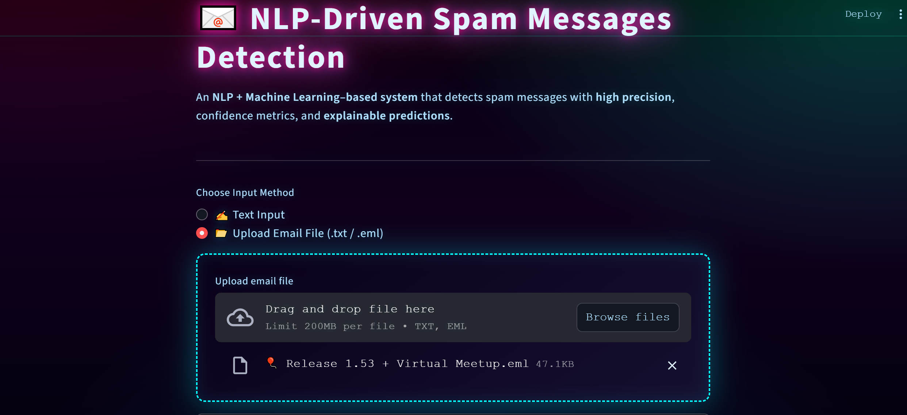
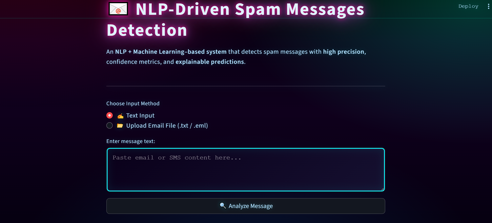
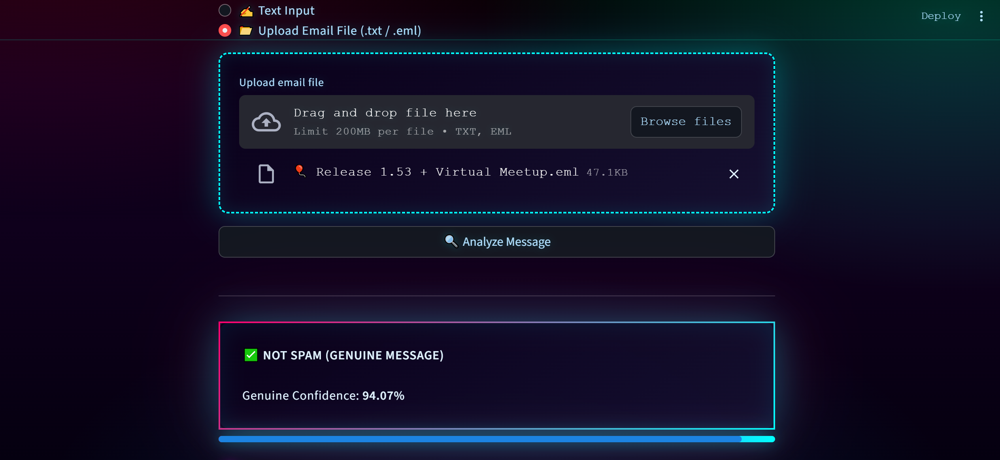
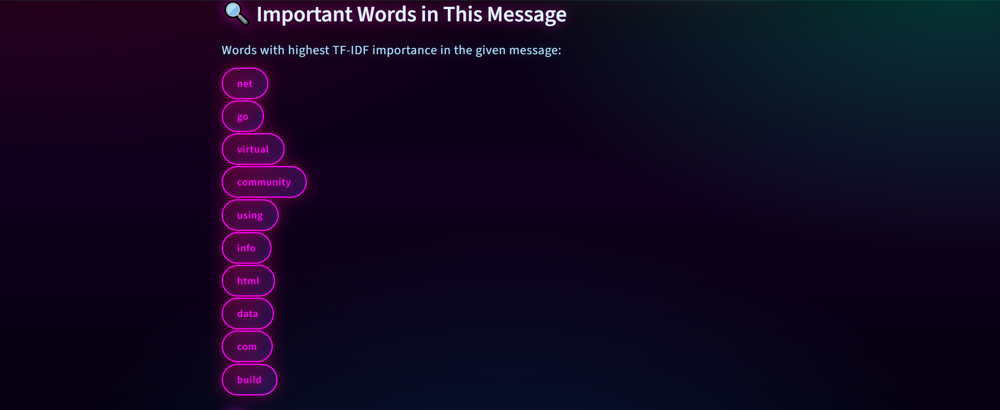
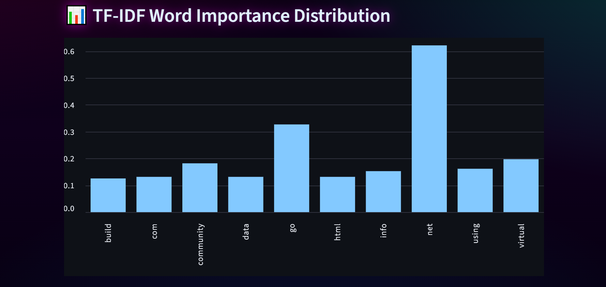
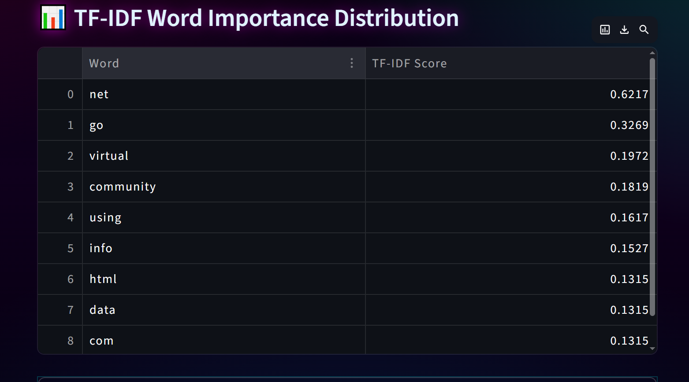
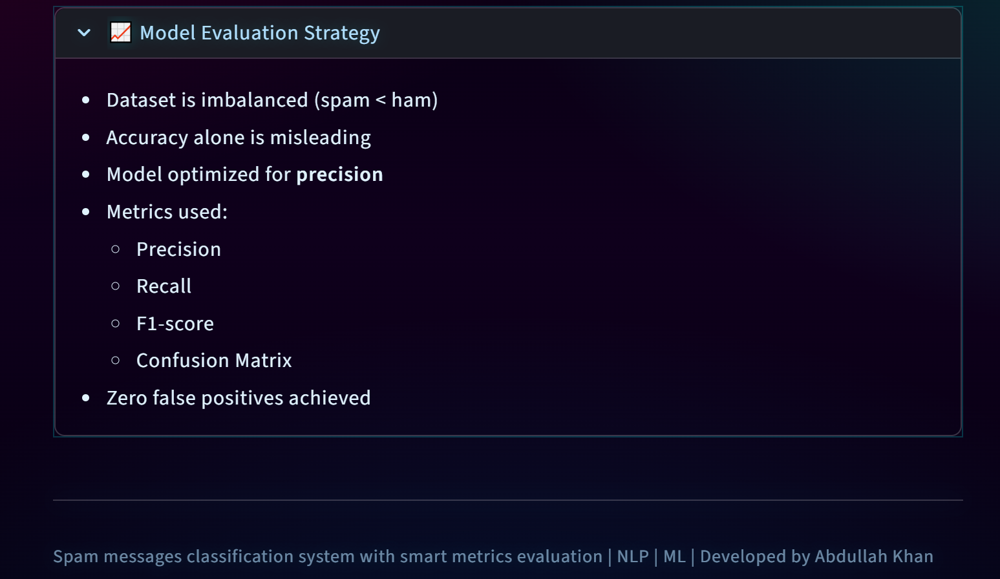

📧 NLP-DRIVEN SPAM MESSAGES DETECTION

A Cyberpunk-Themed, Explainable Spam Classification System.

>> (SCROLL BELOW ⬇️ for LIVE DEMO of this project) 

🚀 PROJECT OVERVIEW :-
NLP-Driven Spam Messages Detection is a modern Natural Language Processing (NLP) + Machine Learning application designed to classify text-based messages as Spam or Not Spam with high precision.

The project goes beyond basic accuracy by providing:
Confidence scores
Detailed evaluation using TF-IDF word importance along with bar graph plotting
Support for real email files (.eml)

✨ KEY FEATURES :-

>> 🔍 Spam vs Genuine Classification
>> 📊 Confidence Metrics (Probability-Based)
>> 🧠 Explainable AI
   Important words contributing to classification
   TF-IDF word importance distribution
>> 📂 Multiple Input Modes
   Direct text input (SMS / message content)
   File upload support: .txt and .eml
>> 📧 Real Email Parsing
   Extracts plain text from .eml email files
>> 🎨 Neon Dark / Cyberpunk UI
   Gradient background
   Glowing buttons, cards, and word chips
   High-contrast colored typography
>> ⚡ Fast & Lightweight

WORKING SCREENSHOTS :-
🔹 Title

🔹 Text input Mode

🔹 File upload Mode (.eml / .txt)

🔹 Important Words (TF-IDF Distribution)

🔹 TF-IDF Word Importance Distribution (bar-graph)

🔹 TF-IDF Word Importance Distribution (statistics)

🔹 Model Evaluation Strategy

🔥 LIVE DEMO :-

🧠 MODEL & NLP PIPELINE :-

>> Text Preprocessing
>> Lowercasing
>> Tokenization
>> Noise removal
>> Feature Extraction
>> TF-IDF Vectorization

MODEL :-
>> Multinomial Naive Baye
>> Saved Artifacts
>> Trained model (.pkl)
>> TF-IDF vectorizer (.pkl)

📈 MODEL EVALUATION STRATEGY :-

Due to the imbalanced nature of spam datasets, the model is evaluated using multiple metrics instead of accuracy alone:
>> Precision
>> Recall
>> F1-Score
>> Confusion Matrix

🎯 The model is optimized for precision, minimizing false positives (important in real-world spam detection).

🛠️ TECH STACK :-

Python
Scikit-learn
NumPy
Pandas
Streamlit
Email Parsing (email.policy, BytesParser)

📌 THE FINAL MODEL ACHIEVED :-
- Zero false positives
- High precision for spam detection
- Acceptable recall with safe trade-offs
